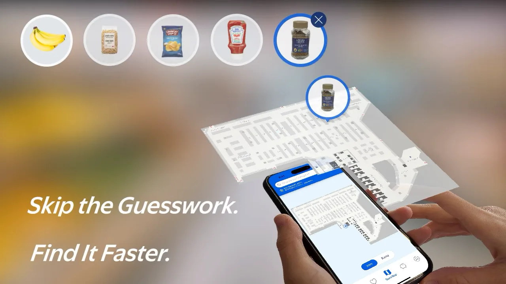
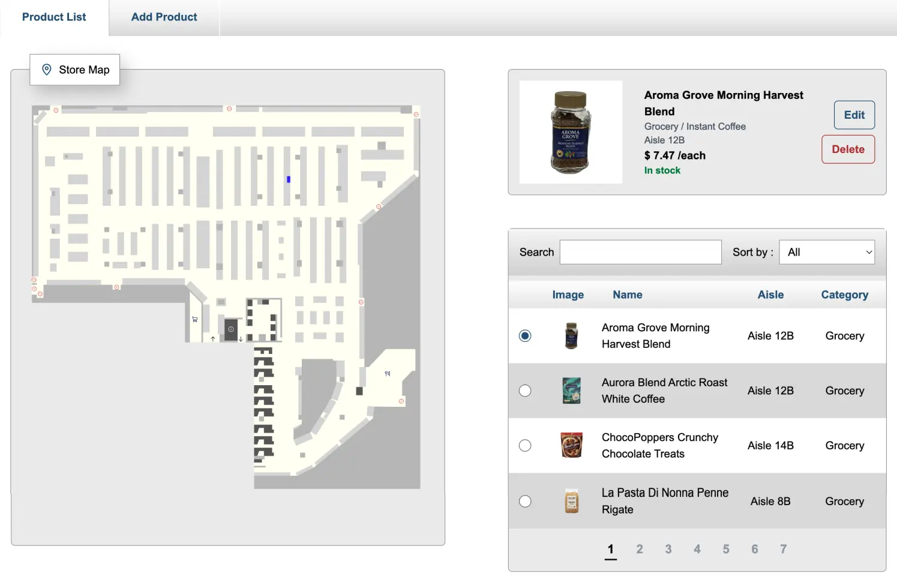
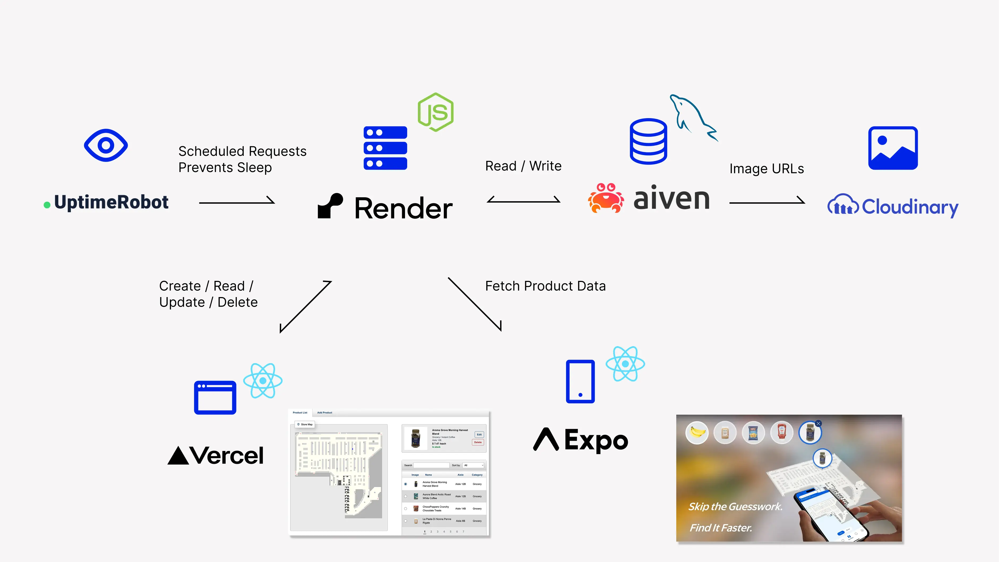

### Building a REST API for a React Native App with Free Services

I created Store Map, a React Native and Expo app that shows shoppers where products are located on supermarket shelves.

I have already covered the background and design process behind Store Map in my portfolio.

Store Map:
https://www.takanari-kondo.com/store-map

This time, I want to document what happens behind the interface: how I stored the product data and shared it between the web and mobile apps.

I built the project using the free tiers of the following services:

- Vercel: hosting the React admin app
- Render: hosting the Node.js and Express server
- Aiven: hosting the MySQL database
- Cloudinary: storing product images
- UptimeRobot: monitoring the API server

### A React Product Management App Built for Class

For a class at BCIT, I built a Node.js and Express backend along with Product Locator, a React admin app for managing the API.

The app supports the following operations:

- Adding a product image, name, in-store location, and other details
- Editing existing product information
- Deleting products

The admin interface makes it easy to manage product data. For example, if a supermarket moves a product to a different location, its location data can be updated directly from the admin app.

### Making the RESTful API Available to the Mobile App

For the class project, I built a RESTful API that could create, retrieve, update, and delete product data. Since I had already built the backend server, I wanted to use it not only with the React admin app from the class, but also with my own React Native mobile app.

By connecting both the React admin app and the React Native mobile app to the same API, they can share a single source of product data. When product details or in-store locations are updated in the admin interface, those changes also appear in the mobile product search app.

### First, I Needed Somewhere to Host the Server

I usually deploy my frontend projects to Vercel. This time, however, I wanted to publish the Node.js and Express server as a standalone backend, separate from the React admin interface.

I chose Render because it can run Node.js and Express as a web server. It allowed me to deploy the Express server I had built locally without making major changes to its structure, and gave me a public API URL that external apps could access.

As a result, both the React admin interface and the React Native mobile app could access the same product data through a shared API.

- [Deploy a Node Express App on Render](https://render.com/docs/deploy-node-express-app)

### Keeping the Server Available 24/7

The challenge was that Render puts the service to sleep after a period of inactivity. This meant that the first API request during a user-testing session could be extremely slow, preventing the mobile app from accessing the database immediately.

To address this, I used UptimeRobot to monitor the server around the clock and help prevent it from going to sleep.

The final project consists of the following services:

I manually upload product images to Cloudinary, then store their URLs in MySQL as part of the product data. Both the React admin app and the React Native Store Map app use the same API.

### This Setup Is Not Realistic to Maintain Indefinitely

For this project, I combined several free services to create an environment where Store Map could run without additional cost. My initial goal was simply to build a working product. The process of making products registered through the React admin interface available in the React Native app also gave me a valuable opportunity to learn more about APIs.

However, the frontend, API, database, image storage, and monitoring all depend on separate services. An outage, pricing change, or the end of a free tier could affect the entire app. The more services the project relies on, the more complicated it becomes to manage.

Combining free services can work well for a portfolio project or prototype, but a product intended for long-term use also needs stability, maintainability, security, backups, and a plan for handling outages. It is also important to consider service limits and unexpected costs as usage grows. With that in mind, it is easy to understand why Backend as a Service platforms such as Supabase have become so popular.

Exploring all of these services gave me a better understanding of what each one offers, and should give me more options to consider when choosing tools for future projects.
