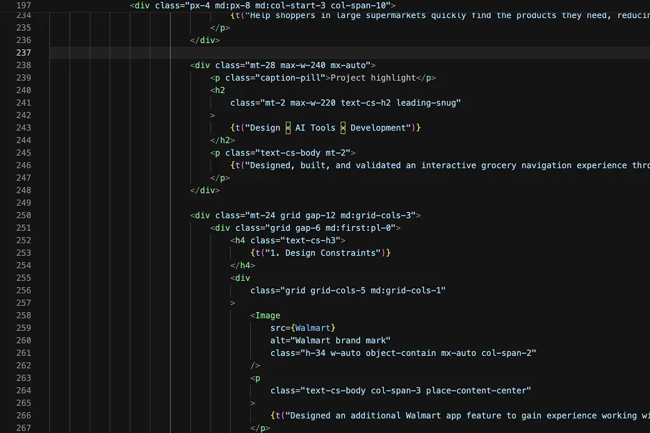

### はじめてのブログ
いままでブログというものを書いたことはありませんでした。 そもそもインターネット上に写真を投稿したり、意見を書き込むと言う行為自体普段やらないことでした。
そのせいでもあり、 日本語自体使う機会が少ない生活をしていることもあり、 いまこうして文を書いているといかに自分が普段AIに頼って文を作成してきたのか実感します。 自分の意見を自分の力で言語化する訓練をしていないので、日常会話ですら支障をきたしている気がしてきて危機感を感じてもいます。 ある意味このブログという機会を通じて良い練習になるのではと期待しています。

### なぜ始めた？
そもそもはポートフォリオの肝であるメインプロジェクトページの作成方法の見直しです。UIUXデザイナーのポートフォリオとしてどういう問題があり、それをどう解決し、どういう結果になり、みたいなことを**HTMLタグで**つらつら書いていました。もちろんこだわりのあるレイアウトとか、JSを使った凝った演出などを使えるというコンテンツとデザインを一体化できる利点はありましたが、タグやクラス、属性などが邪魔で読みにくいと思っていました。 

*ケーススタディのHTMLコード。*

そもそもケーススタディってやっていることがブログと変わらないのではと思い始め、『じゃあ結局マークダウンでブログっぽく書いていった方が楽なのでは』という結論に至りました。それにプロジェクトページの内容は普段から学んでいることの氷山の一角にすぎず、もっと気軽に学んだことを残したい、でもプロジェクトページを無駄に増やしたくない、そうなった時にblogというのはちょうど良いと気づきました。

### Astro Content Collections を利用
このポートフォリオはAstroというフレームワークを使っています。最初ははNext.js(React)で作り始めたのだが、ポートフォリオを作る上で、単純に情報を載せるだけであるのに、ここまでjsを多用する必要はあるのだろうかという疑問を持っていた時にこのAstroというフレームワークに出会いました。 AstroはReactやVueと違い、必要な部分にだけJSを読み込むことができるコンテンツ中心のサイトに適しています。基本的なページはHTMLとして生成されるため、ブログやポートフォリオのような静的コンテンツをシンプルかつ軽量に構築できることが利点です。

本題ですが、AstroはMarkdownとの相性が良いという強みがあります。文章をページのコードと切り離して管理しやすいのです。 このブログではAstro Content Collectionsを利用し、本文はMarkdownで執筆しながら、タイトルや公開日、タグ、サムネイルなどの情報も記事ごとにまとめています。 レイアウトを変更しても各記事を直接編集する必要がなく、長い記事でも書きやすく管理しやすい構成にできます。

### 今後のブログ投稿について
まずはメインプロジェクトページで紹介しきれなかったデザインや開発の裏側などを投稿していきたいです。例えば[商品位置検索アプリ](https://www.takanari-kondo.com/jp/store-map)はマップの位置情報を含めた商品のデータ情報をまとめたAPIを作ったことなど開発面にももっと深い背景があったが載せきれませんできた。インプットしたことを吐き出してあとから自分で見直すことができる場としていきたいです。余裕があればもっとプライベートなことなんかも投稿しようかなとも考えています。

